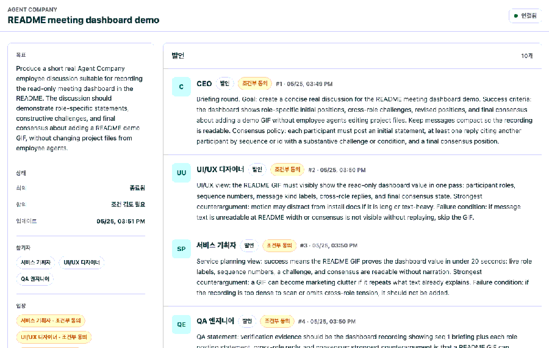

# Agent Company

Agent Company는 Codex 안에서 CEO 주도의 작은 제품 팀을 운영하기 위한 로컬 플러그인입니다. 현재 Codex 세션이 CEO 역할을 맡고, 필요한 직원 역할만 Codex native sub-agent로 호출해 회의, 판단, 구현 제안, 검증을 조율합니다.

직원들은 프로젝트별 로컬 HTTP 회의 서버를 통해 메시지를 읽고 쓰며, 회의 기록과 결정은 `.agent-company/v2` 아래에 파일로 남습니다.

## 주요 기능

- CEO Plan Mode. 직원 실행 전에 목표, 성공 기준, 참여 역할별 담당 요구사항, 검증 계획을 사용자에게 먼저 제안합니다.
- 책임 역할만 호출. 사용자 요구사항에 직접 책임이 있거나 실질적 리스크를 소유한 역할만 선택합니다.
- 병렬 직원 실행. 선택된 직원 sub-agent를 먼저 모두 시작한 뒤, 회의 메시지와 가능한 multi-target wait로 함께 모니터링합니다.
- 적대적 라운드 기반 회의. 직원은 초기 입장, 상호 반박, 입장 수정, 최종 합의 라운드를 거치며 다른 직원 메시지를 sequence 또는 id로 참조하고 최강 반대 가설과 실패 조건을 남깁니다.
- 명시적 Deep Discussion. `$agent-company:deep-discussion`으로 호출하면 고정 라운드 수 없이 토론하고, 참가자 전원이 최종 `agree`에 도달할 때만 회의를 닫습니다.
- 로컬 회의 서버. `start_company`가 `127.0.0.1`에 프로젝트별 HTTP 서버를 시작하고, `create_meeting`이 직원용 접속 URL, 토큰, 브라우저용 `viewerUrl`을 반환합니다.
- 회의 보기. `viewerUrl`을 브라우저에서 열면 현재 회의의 발언 타임라인과 합의 상태를 읽기 전용으로 볼 수 있습니다.
- 파일 기반 기록. 회의 메타데이터, 메시지, 결정, 서버 상태를 `.agent-company/v2`에 저장합니다.
- 합의 기반 종료. 모든 필수 직원이 `agree` 또는 `conditional` 입장을 남기고 런타임 토론 충족 판정을 통과하면 CEO가 조건부 동의 조건을 보존한 뒤 회의를 닫습니다.

## 요구 사항

- Codex CLI 또는 Codex 플러그인과 MCP를 사용할 수 있는 환경.
- Codex native sub-agent 또는 multi-agent 기능을 사용할 수 있는 환경.
- Node.js `22.12` 이상.
- `npm`.
- Git.

## 빠른 시작

의존성을 설치하고 플러그인을 검증합니다.

```sh
npm install
npm run check
```

Codex 플러그인으로 설치합니다.

```sh
codex plugin add agent-company@agentinc-local
```

Codex 세션에서 다음처럼 스킬을 호출합니다.

```text
$agent-company:company TODO 앱의 다음 기능을 기획하고 필요한 직원만 회의시켜줘
```

고정 라운드 수 없이 전원 동의까지 토론시키려면 다음처럼 별도 스킬을 호출합니다.

```text
$agent-company:deep-discussion TODO 앱의 유료화 정책을 직원들이 전원 동의할 때까지 토론해줘
```

CEO는 먼저 실행 계획을 제안합니다. 사용자가 승인하면 `start_company`, `create_meeting`, 직원 sub-agent 실행, `meeting_status` 모니터링, `close_meeting` 순서로 회의를 진행합니다.

## Deep Discussion 모드

`$agent-company:deep-discussion`은 사용자가 명시적으로 호출하는 장기 토론 모드입니다. 표준 회의처럼 CEO Plan Mode와 사용자 승인 절차를 거치지만, 고정 라운드 수를 두지 않고 참가자 전원이 최종 `agree`에 도달할 때까지 토론을 이어갑니다.

```text
$agent-company:deep-discussion 새 온보딩 플로우를 어떤 구조로 가져갈지 직원들이 전원 동의할 때까지 토론해줘
```

| 구분 | 표준 `$agent-company:company` | `$agent-company:deep-discussion` |
| --- | --- | --- |
| 회의 흐름 | 브리핑, 초기 입장, 상호 반박, 입장 수정, 최종 합의 라운드 중심 | 최소 구조만 유지하고 쟁점이 남으면 추가 반박과 재검토를 계속 진행 |
| 종료 조건 | `agree` 또는 `conditional`과 토론 충족 상태를 기반으로 CEO가 조건을 보존해 종료 | 참가자 전원이 최종 `agree`를 남길 때만 종료 |
| `conditional` 처리 | 조건을 최종 합의와 다음 액션에 보존하면 잠정 합의 가능 | 완료로 보지 않고 조건을 다시 토론에 올려 전원 `agree`로 전환 |
| 사용자 개입 | 재료가 부족하거나 결정이 필요하면 CEO가 질문 | `needs-user`나 해결 불가능한 선택지가 남으면 CEO가 멈추고 선택지를 보고 |

이 모드는 제품 방향, 정책, 아키텍처처럼 역할 간 관점 차이를 끝까지 좁혀야 하는 결정에 적합합니다. 단순 구현 작업이나 빠른 검토는 표준 `$agent-company:company`가 더 가볍습니다.

## 회의 대시보드 데모

`viewerUrl`을 열면 직원 에이전트들의 발언, 반박, 조건부 합의가 읽기 전용 타임라인으로 표시됩니다. 아래 데모는 실제 Agent Company 회의 기록을 캡처한 것입니다.



## 운영 흐름

1. CEO가 사용자 요청을 목표와 성공 기준으로 정리합니다.
2. CEO가 선택한 직원별 담당 요구사항, 참여 이유, 합의 정책을 포함한 계획을 제안합니다.
3. 사용자가 승인하면 `start_company`로 `.agent-company/v2` 상태와 로컬 회의 서버를 준비합니다.
4. `create_meeting`으로 회의방, 직원용 HTTP 접속 정보, 브라우저용 `viewerUrl`을 만듭니다.
5. 선택된 직원 sub-agent를 모두 먼저 시작합니다.
6. 직원들은 회의 서버에서 메시지를 읽고 초기 입장, 상호 반박, 입장 수정, 최종 합의 라운드를 남기며 주요 전제에 반박하거나 합의 가능 조건을 제시합니다. Deep Discussion 모드에서는 고정 라운드 수 없이 전원 `agree`까지 토론을 이어갑니다.
7. CEO가 `meeting_status`로 실제 메시지, 참조된 발언, 합의 상태, 조건부 참가자, 반박 부족 여부를 확인합니다.
8. 합의가 나면 `close_meeting`으로 요약, 보존된 조건을 포함한 합의, 남은 질문, 다음 액션을 기록합니다.
9. 중요한 결정은 `record_decision`으로 `.agent-company/v2/decisions.jsonl`에 남깁니다.

## 레포 구조

```text
.
├── .codex-plugin/plugin.json
├── .mcp.json
├── assets
├── references
├── scripts
├── server
├── skills
├── package.json
└── README.md
```

| 경로 | 역할 |
| --- | --- |
| `skills/company/SKILL.md` | CEO Plan Mode 운영 절차와 승인 규칙입니다. |
| `server/src` | v2 상태 관리, MCP JSON-RPC stdio 서버, 로컬 HTTP 회의 서버입니다. |
| `references/roles` | 직원 역할별 판단 기준과 작업 절차입니다. |
| `references/protocols` | 승인, 라우팅, 회의, 출력 계약, 작업 방식 프로토콜입니다. |
| `scripts/validate-plugin.mjs` | 플러그인 manifest, skill, MCP, 문서 구조 검증 스크립트입니다. |

## 런타임 상태

대상 프로젝트에는 `.agent-company/v2` 디렉터리가 생성됩니다.

| 상태 파일 | 설명 |
| --- | --- |
| `.agent-company/v2/config.json` | v2 회사 상태 메타데이터입니다. |
| `.agent-company/v2/server/` | 회의 서버 URL, pid, log, token 정보입니다. |
| `.agent-company/v2/meetings/<meeting_id>/meeting.json` | 회의 제목, 목표, 참가자, 상태입니다. |
| `.agent-company/v2/meetings/<meeting_id>/messages.jsonl` | CEO와 직원의 회의 메시지입니다. |
| `.agent-company/v2/decisions.jsonl` | CEO가 기록한 중요한 결정입니다. |

직원 간 대화를 브라우저에서 보고 싶으면 `create_meeting` 결과의 `viewerUrl`을 열면 됩니다.

```text
http://127.0.0.1:<port>/meetings/<meeting_id>?token=<token>
```

파일 기록을 직접 확인하려면 해당 회의의 `messages.jsonl`을 읽으면 됩니다.

다중 참가자 회의에서 전원이 동의했더라도 구조적 반박 라운드가 부족하면 consensus snapshot의 `discussionSatisfied`가 false가 되고 `discussionInsufficientParticipants`에 부족한 역할이 표시됩니다. 이때 `consensus.reached`는 false이며 viewer는 “반박 부족” 상태를 보여줍니다.

조건부 동의는 consensus snapshot의 `conditionalParticipants`에 남으므로, CEO는 회의를 닫을 때 조건부 동의 조건을 합의문과 다음 액션에 보존해야 합니다.

```sh
cat .agent-company/v2/meetings/<meeting_id>/messages.jsonl
```

## MCP 도구

| 도구 | 설명 |
| --- | --- |
| `start_company` | 대상 프로젝트에 v2 상태를 준비하고 로컬 회의 서버를 시작합니다. |
| `company_status` | v2 설정, 서버 상태, 활성 회의, 최근 결정을 읽습니다. |
| `create_meeting` | 참가자와 합의 정책이 있는 회의를 만들고 직원용 HTTP 접속 정보와 브라우저용 `viewerUrl`을 반환합니다. |
| `meeting_status` | 회의 메시지와 현재 합의 상태를 읽습니다. |
| `post_message` | CEO 또는 직원 메시지를 회의에 추가합니다. |
| `close_meeting` | 회의 요약, 합의, 남은 질문, 다음 액션을 기록하고 회의를 닫습니다. |
| `record_decision` | 중요한 CEO 결정을 JSONL 로그에 기록합니다. |
| `stop_company` | 실행 중인 프로젝트 로컬 회의 서버를 종료합니다. |

## 개발 명령

```sh
npm run validate
npm test
npm run check
```

| 명령 | 설명 |
| --- | --- |
| `npm run validate` | 플러그인 manifest, skill 문구, MCP smoke test, 역할 문서 구조를 검증합니다. |
| `npm test` | v2 런타임, 회의 메시지, 합의, HTTP 서버 인증, 서버 종료 흐름을 검증합니다. |
| `npm run check` | validate와 test를 순서대로 실행합니다. |

`npm test`는 로컬 HTTP 서버를 `127.0.0.1`에 바인딩하므로 일부 sandbox 환경에서는 listen 권한이 필요할 수 있습니다.

## 안전 규칙

Agent Company v2는 직원 실행 전에 사용자 승인을 요구합니다. 다음 작업도 명시 승인이 필요합니다.

- 배포.
- 파괴적 삭제.
- 비용 발생.
- 외부 공개.
- 자격 증명 변경.
- 원격 저장소 push.
- 제품 방향의 큰 변경.

구현 작업이 필요한 경우 직원은 별도 sub-agent workspace에서 패치 제안을 만들고, CEO가 검토한 뒤 현재 프로젝트에 통합합니다.

## 라이선스

아직 별도 라이선스 파일은 포함하지 않았습니다. 공개 저장소로 열려 있더라도 사용, 수정, 재배포 조건은 라이선스가 추가되기 전까지 명시적으로 부여되지 않습니다.
